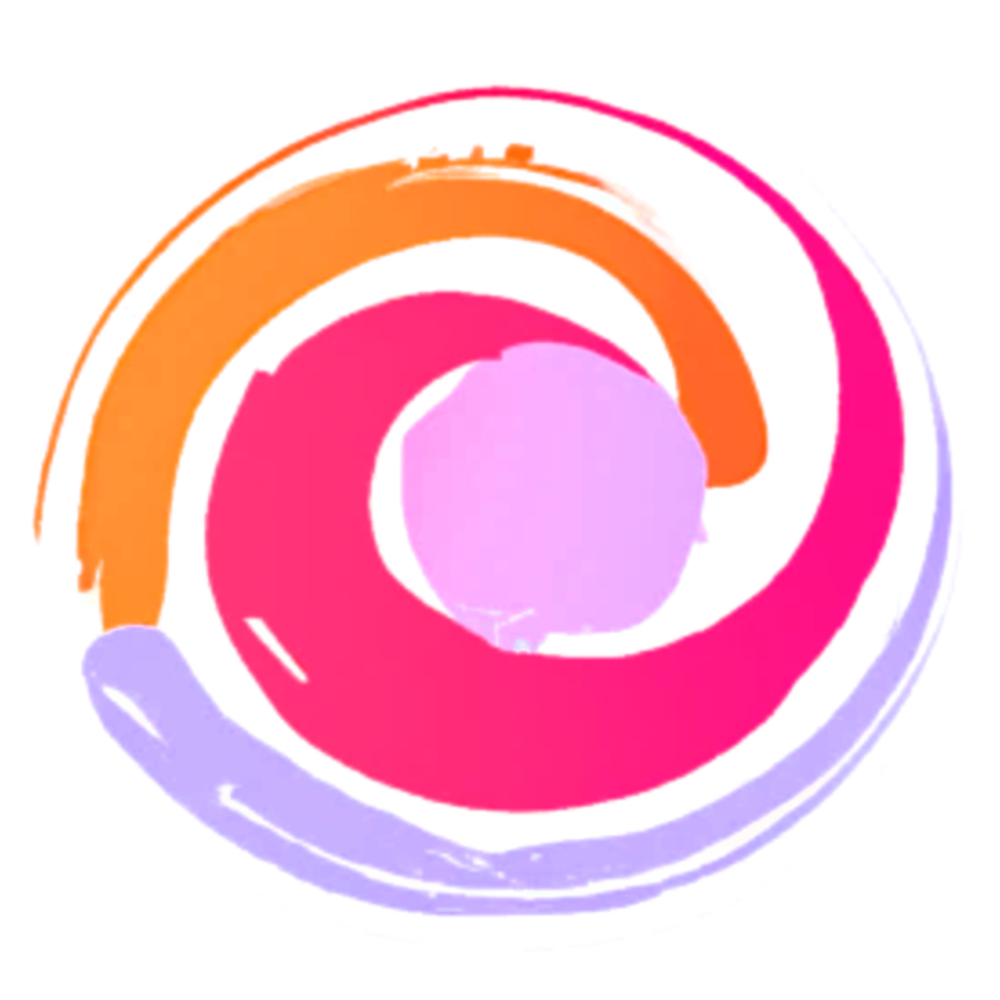

<div align="center">


<h1>SteveNetworking</h1>

[](https://github.com/Steveplays28/nexlib/blob/main/LICENSE)

[](https://github.com/Steveplays28/nexlib/network/members)
[](https://github.com/Steveplays28/nexlib/issues)
[](https://github.com/Steveplays28/nexlib/pulls)

[](https://discord.gg/KbWxgGg)
[](https://twitter.com/Steveplays28)

Lightweight C# UDP networking library.
</div>

## Getting started

### Installation  
Download the latest release, extract it into your project, and add the following to your `.csproj` file (inside the `<Project>` tag):
```
<ItemGroup>
  <Reference Include="SteveNetworking">
    <HintPath>PATH\TO\SteveNetworking\SteveNetworking.dll</HintPath>
  </Reference>
</ItemGroup>
```
<sup>Make sure to change the path to the location of the dll!</sup>

This library works with any .NET 6 project. Specific support has been added for Godot 4.0.

### Development
```
git clone https://github.com/Steveplays28/steve-networking.git
cd steve-networking
dotnet build
```

## Problems and suggestions  
If you've found a problem or want to make a suggestions, feel free to [open an issue](https://github.com/Steveplays28/nexlib/issues/new)!

Please check if there isn't already an issue open for your problem/suggestion.  
I will respond as soon as I can.

## Contributing  
If you want to add or change something, feel free to [make a pull request](https://github.com/Steveplays28/nexlib/compare)!

Please check if there isn't already a pull request open for this specific issue.  
I will respond as soon as I can.

## License  
This project is licensed under the LGPLv2.1 License, see the [LICENSE file](https://github.com/Steveplays28/nexlib/blob/main/LICENSE) for more details.
